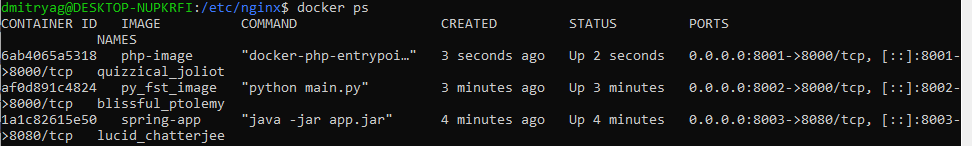
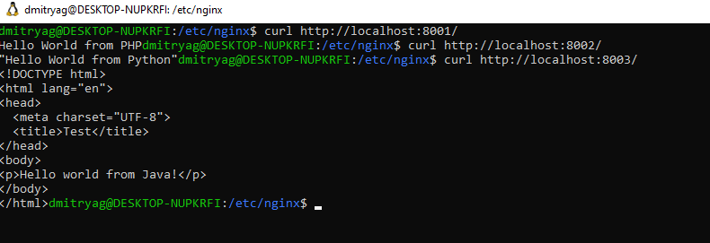
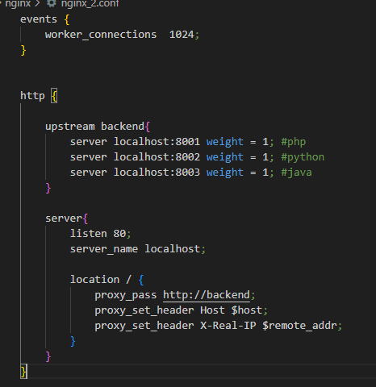
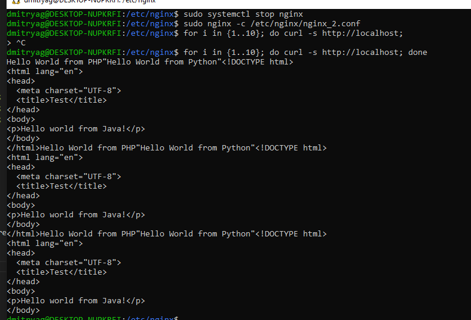

devops  
Мониторинг  

    Были созданы и запущены три Docker контейнра: 
Java Spring Порт: 8003  
Python FastAPI Порт: 8002  
PHP Laravel Порт: 8001  

Далее был создан кастомный конфигурационный файл для nginx в котором мы задали соотношение 1:1:1, которое и было получено в последующем тестировании
При запуске серверов соотношение запусков приложений оказалось 3:3:3

