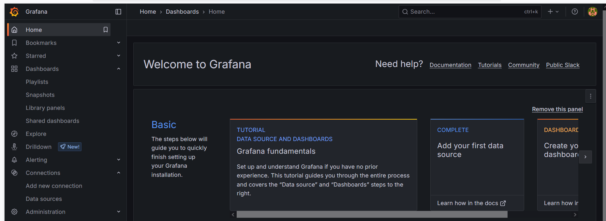
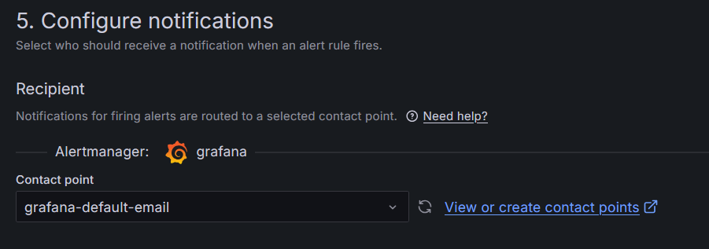
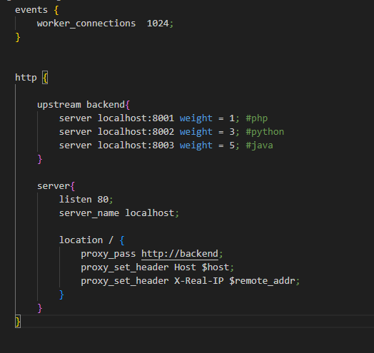
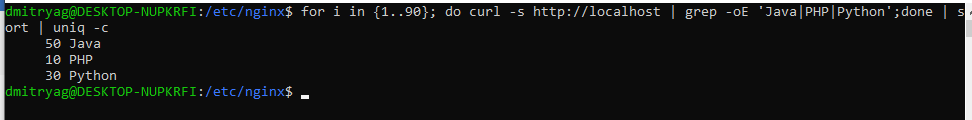

devops  
Мониторинг  

  

Были созданы и запущены три Docker контейнра: 
Java Spring Порт: 8003  
Python FastAPI Порт: 8002  
PHP Laravel Порт: 8001  

  
Далее был создан кастомный конфигурационный файл для nginx в котором мы задали соотношение 1:1:1, которое и было получено в последующем тестировании
При запуске серверов соотношение запусков приложений оказалось 3:3:3

  
Далее мы изменили веса на 1 для php, 3 для python и 5 для java. Запустили сервер на новой конфигурации и провели тестирование, в ходе которого соотношение оказалось равным 10:30:50, что соответствует конфигурации  

